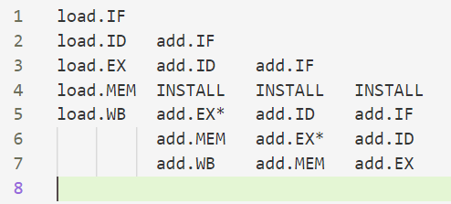
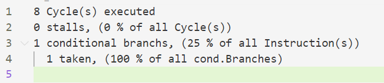
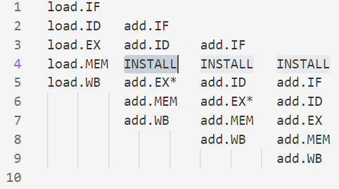

# 流水线性能分析Ⅱ实验报告

​						计试001 苏悦馨 2204120515

## 1.实验简述

本实验自行实现了MIPS五段流水线的模拟器。实现的模拟器具有如下功能：

- 命令交互
- 支持单步执行/执行到断点/执行到程序结束
- 支持流水线各个段和寄存器状态的查看
- 提供是否使用定向路径的选项
- 提供程序执行后的统计性能分析
- 按照MIPS语法支持load、store、add、beqz四种操作

所执行的程序通过直接输入的方式来实现。提交的代码中，`simulator.h`是该模拟器的定义及实现；`main.cpp`是对该模拟器功能的具体调用测试和演示。本实验报告中所有截图和示例代码，都可通过`main.cpp`运行得到。

以下`自行实现的的MIPS五段流水线的模拟器`简称`模拟器A`。

## 2.模拟器A的设计思想和特色

该模拟器A的类定义如下

```c++
class simulator
{
public:
    // 和cpu有关的变量
    int reg[10] = {0};      // 分别代表从 $t0 到 $t9的值,随机设置的
    int data_mem[64] = {0}; // 设置了64w的datamem大小

    // 模拟器控制全局变量
    bool redirect = false;  // 是否使用重定向技术
    int cur_inst_num = -1;          // 当前正在执行到第几条指令
    vector<vector<log_item>> logs;  // 记录流水线日志
    vector<inst_item> instructions; // 记录全部的指令
    int count_install = 0;          // 记录stall的个数
    int count_branch = 0;           // 记录branch的个数
    int count_branch_taken = 0;     // 记录branch taken的个数

    // function
    void load_code(vector<inst_item> code, bool flag); 
    // 导入代码，完成初始设置
    void run_next();                                   
    // 单步执行一个周期
    void run_to_bp(int to_inst, string to_stage);      
    // 执行到断点
    void run();                                        
    // 执行到程序结束
    void show_register();                              
    // 查看流水线寄存器状态
    void show_pipeline(string path);                   
    // 查看流水线各个段
    void statistic(string path);                       
    // 程序执行后的统计性能分析
};
```

其中和cpu有关的变量，定义了10个寄存器，分别为`$t0,$t1,...,$t9`，初值设置为0；并且定义了大小为`64x32bit`的数据存储器；

其中用于模拟器控制的全局变量，定义了`redirect`来决定是否使用重定向技术；`cur_inst_num`记录目前模拟器执行到的指令的地址；`logs`是流水线日志，记录每一个时钟周期的流水线状态；`instructions`负责加载全部的待模拟指令；`count_install`，`count_branch`，`count_branch_taken`为模拟器进行统计性能分析所用。

该模拟器A的特色在于指令是顺序流入和顺序流出的，如果前面的指令发生install，后面的指令也会发生install；且所有的RAW冲突都可以在ID段被检测出来，beqz指令也在ID段完成是否发生跳转的判断。另外，该模拟器由c++类封装实现，具有良好清晰的定义，并且调用和实现都很方便。

## 3.模拟器A的测试代码组合

该模拟器所用到的测试代码组合如下。后文在用到这些测试代码组合时，直接通过`code1`，`code2`，`code3`，`code4`来引用此处的代码。

```
code1:
add $t0 $t1 $t2
load $t4 $t5 1
add $t7 $t8 $t9

code2:
add $t0 $t1 $t2
add $t4 $t0 $t3
load $t4 $t5 1

code3:
load $t4 $t5 1
add $t1 $t2 $t4
add $t0 $t1 $t2
add $t7 $t8 $t9

code4:
add $t0 $t1 $t2
beqz $t0 1
load $t4 $t5 1
add $t7 $t8 $t9
```

## 4.模拟器A功能实现

### 4.1 命令交互功能

交互运行程序`code1`如下：

单步执行一个时钟周期：


流水线各段情况：


再单步执行一个时钟周期：


流水线各段情况：

<font color='red'> (注意本模拟器的流水线由于输出的原因，是竖着打印的；因此纵轴代表时钟周期，横轴代表指令) </font>


执行到断点


流水线各段情况：

<font color='red'> (注意本模拟器的流水线由于输出的原因，是竖着打印的；因此纵轴代表时钟周期，横轴代表指令) </font>


执行到结束：


流水线各段情况：

<font color='red'> (注意本模拟器的流水线由于输出的原因，是竖着打印的；因此纵轴代表时钟周期，横轴代表指令) </font>


### 4.2 单步执行功能

单步执行功能由`simulator class`中的`run_next()`函数定义。直接调用`run_next()`即可向前执行一个时钟周期。`run_next()`函数利用日志`simulator::logs`中记载的上一个时钟周期的信息，进行下一个时钟周期的执行，主要分为一下五种情况

- 上一个时钟周期在`IF`段

  直接向下执行

- 上一个时钟周期在`ID`段

  要判断是否存在冲突，以及指令是否可以流出。判断是否存在`RAW`冲突，以及根据是否启用`redirect`来判断是否流出的代码如下

  ```c++
  // add指令的RAW冲突
  if (tmp_inst.inst == "add" && (tmp_inst.d1 == source_reg1 || tmp_inst.d1 == source_reg2))
  {
      if (pre_log[j].stage == "IF" || pre_log[j].stage == "ID") // 没产生结果
      {
          new_log.push_back(log_item(pre_log[i].number, true, pre_log[i].inst, pre_log[i].stage));
          install_flag = true;
      }
      else if (pre_log[j].stage == "EX" || pre_log[j].stage == "EX*" || pre_log[j].stage == "MEM") // 产生结果了但是还没写回
      {
          if (redirect) // 可以重定向，就流出了
              new_log.push_back(log_item(pre_log[i].number, false, pre_log[i].inst, "EX*"));
          else
          {
              new_log.push_back(log_item(pre_log[i].number, true, pre_log[i].inst, pre_log[i].stage));
              install_flag = true;
          }
      }
      else // 产生结果并且已经写回了
          new_log.push_back(log_item(pre_log[i].number, false, pre_log[i].inst, "EX"));
  
      flag = true;
      break;
  }
  ```
  ```c++
  // load指令的RAW冲突
  else if (tmp_inst.inst == "load" && (tmp_inst.d1 == source_reg1 || tmp_inst.d1 == source_reg2))
  {
      if (pre_log[j].stage == "MEM") // 产生结果还没写回
      {
          if (redirect) // 可以重定向，就流出了
              new_log.push_back(log_item(pre_log[i].number, false, pre_log[i].inst, "EX*"));
          else
          {
              new_log.push_back(log_item(pre_log[i].number, true, pre_log[i].inst, pre_log[i].stage));
              install_flag = true;
          }
      }
      else if (pre_log[j].stage == "WB") // 产生结果并且已经写回
          new_log.push_back(log_item(pre_log[i].number, false, pre_log[i].inst, "EX"));
      else // 没产生结果
      {
          new_log.push_back(log_item(pre_log[i].number, true, pre_log[i].inst, pre_log[i].stage));
          install_flag = true;
      }
  
      flag = true;
      break;
  }
  ```
  
  同时对于`beqz`指令应当判断是否该周期跳转成功。实现代码如下：
  
  ```c++
  // 对于beqz在ID段，要判断会不会跳转
  if (pre_log[i].inst == "beqz" && cur_inst.d1 == 0)
  {
      cur_inst_num = cur_inst_num + cur_inst.d3 - 1;
      new_log.push_back(log_item(pre_log[i].number, false, pre_log[i].inst, "EX"));
      new_log.push_back(log_item(-1, false, "ABORTED", "ABORTED"));
      i = i + 1;
      continue;
  }
  ```
  
- 上一个时钟周期在`EX`段

  直接向下执行

- 上一个时钟周期在`MEM`段

  直接向下执行

- 上一个时钟周期在`WB`段

  不再执行

- 该时钟周期需要新增一条指令

  ```c++
  // 查看是否有需要新加入的指令
  if ((cur_inst_num < int(instructions.size()) - 1)) // 可以加入新的指令
  {
      if (!install_flag)
      {
          cur_inst_num = cur_inst_num + 1; // 如果跳转，cur_inst_num之前已经被修改过了
          new_log.push_back(log_item(cur_inst_num, false, instructions[cur_inst_num].inst, "IF"));
      }
      else
          new_log.push_back(log_item(-1, true, "INSTALL", "INSTALL")); // 由于前面的指令INSTALL，导致不能流入新指令
  }
  ```

### 4.3 执行到断点功能

执行到断点功能由`simulator class`中的`run_to_bp(int to_inst, string to_stage)`函数定义；`inst`指出运行到的指令的地址，`to_stage`指出运行到该指令的五段流水线的哪一个阶段。直接调用`run_to_bp(int to_inst, string to_stage)`即可执行到断点停止，交互演示如下：

<font color='red'> (注意本模拟器的流水线由于输出的原因，是竖着打印的；因此纵轴代表时钟周期，横轴代表指令) </font>

```c++
// 运行到断点的演示
simulator sim4;
sim4.load_code(code3,true);
sim4.run_to_bp(3,"EX");
sim4.show_pipeline("sim4.txt");
```



### 4.4 执行到程序结束

执行到结束由`simulator class`中的`run()`函数定义。直接调用`run()`即执行到程序结束。

```c++
void simulator::run()
{
    // 如果日志为空、没有执行到最后一条指令的最后一个阶段，就运行
    while (logs.empty() || logs.back().back().stage != "WB")
        run_next();
    return;
}
```

### 4.5 流水线各个段的查看

流水线各个段查看通过`void simulator::show_pipeline(string path)`来实现。`simulator class`中定义了日志变量`logs`，对每一个时钟周期的流水线各个段做保存,`show_pipeline(string path)`直接打印模拟器A的日志`logs`到指定的文件路径`path`

```c++
void simulator::show_pipeline(string path) // 输出到txt
{
    ofstream outfile(path);
    for (int i = 0; i < logs.size(); i++)
    {
        vector<log_item> l = logs[i];
        for (int j = 0; j < l.size(); j++)
            if (l[j].stage == "")
                outfile << setw(10) << setiosflags(ios::left) << " ";
            else if (l[j].install)
                outfile << setw(10) << setiosflags(ios::left) << "INSTALL";
            else
                outfile << setw(10) << setiosflags(ios::left) << l[j].inst + "." + l[j].stage;
        outfile << endl;
    }
    outfile.close();

    return;
}
```

### 4.6 寄存器状态的查看

寄存器状态的查看通过`void simulator::show_register()`来实现。`simulator class`中定义了10个寄存器`$t0,$t1,...$t9`,`show_register()`直接打印这些寄存器的值

```c++
void simulator::show_register()
{
    cout << "show register: " << endl;
    for (int i = 0; i < 10; i++)
        cout << "$t" << i << ": " << reg[i] << endl;
    return;
}
```

### 4.7 提供是否使用定向路径的选项

`simulator class`中定义了布尔变量`redirect`，通过设置`redirect`的值，可选择是否使用重定向功能。具体在`5.2 有至少一次的RAW冲突的场景`中，对该功能有演示。

### 4.8 提供程序执行后性能统计的分析

程序执行后的性能统计分析通过`void simulator::statistic(string path)`来实现；`simulator class`中定义了变量`count_install`,`count_branch`,`count_branch_taken`，分别记录有几个`install`，产生了几个`conditonal branch`，以及`condition branch`中有几个跳转了；`statistic(string path)`直接打印统计性能分析到指定的文件路径`path`。

执行`code3`（开启`redirect`）后的统计性能分析如下：


执行`code4`（开启`redirect`）后的统计性能分析如下：



## 5.模拟器A的功能演示

### 5.1 没有任何冲突的流水线场景

```
code1:
add $t0 $t1 $t2
load $t4 $t5 1
add $t7 $t8 $t9
```

对于五段顺序流入和顺序流出的流水线，只可能存在`RAW`冲突；而对于测试代码`code1`，不存在`RAW`冲突，因此对应于没有任何冲突的流水线场景。

运行测试代码`code1`，得到流水线各个段状态如下：
<font color='red'> (注意本模拟器的流水线由于输出的原因，是竖着打印的；因此纵轴代表时钟周期，横轴代表指令) </font>


### 5.2 有至少一次的RAW冲突的场景

```
code3:
load $t4 $t5 1
add $t1 $t2 $t4
add $t0 $t1 $t2
add $t7 $t8 $t9
```

对于测试代码`code3`，可以看到第一条`load`指令要存数到`$t4`，而第二条`add`指令要从`$t4`读取数据，因此存在`RAW`冲突；而第二条add指令要写数到`$t1`，而第三条`add`指令要从`$t1`读取数据，因此存在两个`RAW`冲突。

在`允许重定位`的情况下，运行测试代码`code3`，得到流水线各个段状态如下：
<font color='red'> (注意本模拟器的流水线由于输出的原因，是竖着打印的；因此纵轴代表时钟周期，横轴代表指令)</font>



在`不允许重定位`的情况下，运行测试代码`code3`，得到流水线各个段状态如下：
<font color='red'> (注意本模拟器的流水线由于输出的原因，是竖着打印的；因此纵轴代表时钟周期，横轴代表指令)</font>


### 5.3 有至少一次分支跳转的场景

```
code4:
add $t0 $t1 $t2
beqz $t0 1
load $t4 $t5 1
add $t7 $t8 $t9
```

对于测试代码`code4`，第二条`beqz`指令会产生跳转（寄存器`$t0`计算后的值为0），因此会去执行第四条指令`add`；而第三条指令在`ID`段产生`ABORTED`。因此`code4`对应了有至少一次分支跳转的场景。

运行测试代码`code4`，得到流水线各个段状态如下：
<font color='red'> (注意本模拟器的流水线由于输出的原因，是竖着打印的；因此纵轴代表时钟周期，横轴代表指令)</font>


## 6.实验感悟

本实验自行实现了MIPS五段流水线的模拟器，加深了对计算机流水线基本概念的理解；

同时加深了对MIPS结构如何实现5段流水线的理解，理解了各段的功能和基本操作；

也加深了对数据冲突、结构冲突、控制冲突的理解，并且能够分析这些冲突对CPU性能的影响。
